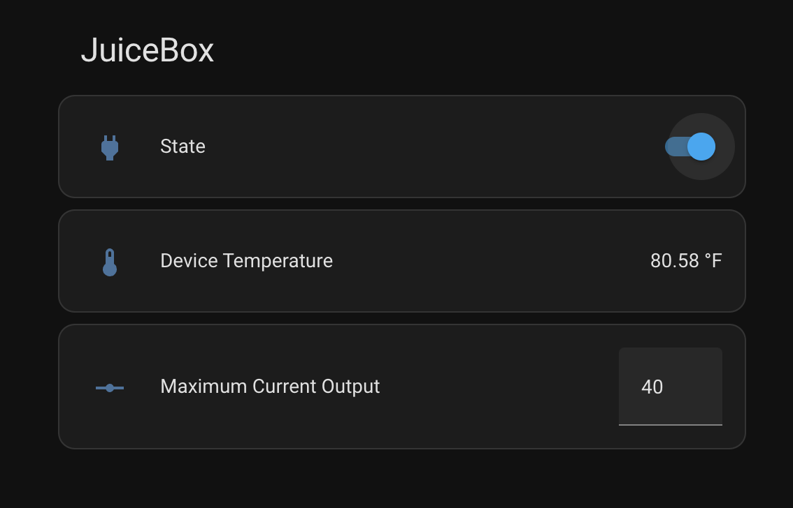

# Initial proof-of-concept showing representation of a JuiceBox EV Charger with a Matter interface. 
Initially the impementiation just shows status, but more can be done. 

The Matter standard defines an EVSE (Electric Vehicle Supply Equipment) device, but as 
of Fall 2024, none of the stnadard Matter controllers such as Google, Apple, Alexa, Home Assistant, etc. support it. And similarlly 
Matter provides for a Device Energy Management device, but again support is limited. For this implementation, I utilize a simple
socket device with level control to represent the output setting for the charger. And I add a Matter temperature sensor to show
the reported temperature of the JuiceBox. Unfortunately, the only controller I have seen that supported the optional level control 
for the socket is Home Assistant. Google, Apple, and SmartThings all ignore it. Alexa shows the control, but either my implementation
is fawed, or Alexa doesn't handle it properly. It is hoped that as time goes by, more support will come to these controllers.

My implementation is mostly glue-code using matter.js (https://github.com/project-chip/matter.js) and 
JuiceBoxProxy (https://github.com/JuiceRescue/juicepassproxy) code that has been converted to Typescript by ChatGPT.  Thanks to the
hard work from these folks


## Running

If you have [Node.js](https://nodejs.org/) installed you can run yourself:

```
git clone https://github.com/JimBuzbee/matter-juicebox.git
cd matter-device
npm install
```

edit the run.sh file to chane IP address and then execute it. When the QR code appears on the screen, scan it in using
your chosen Matter controller.




